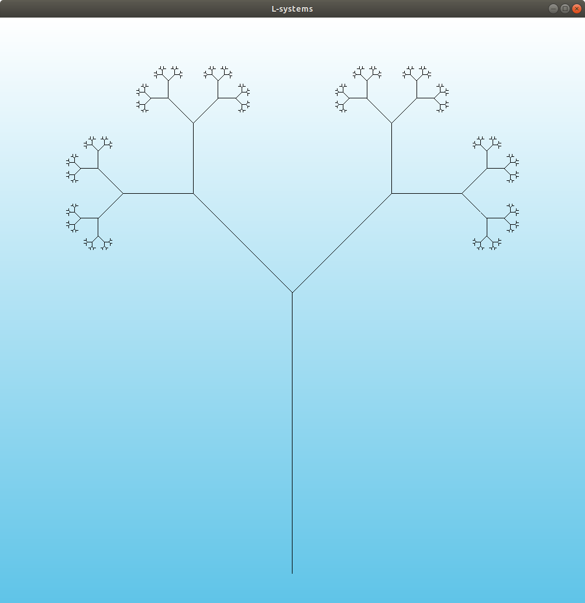
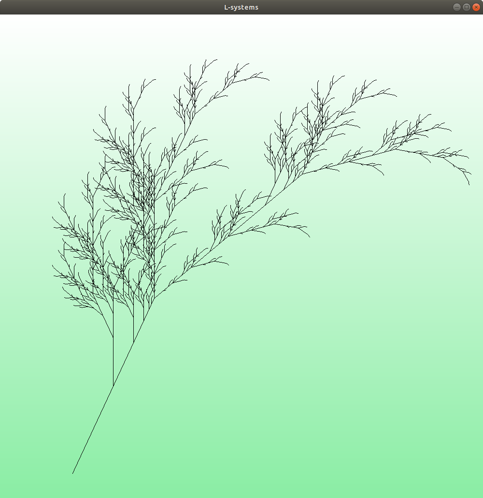
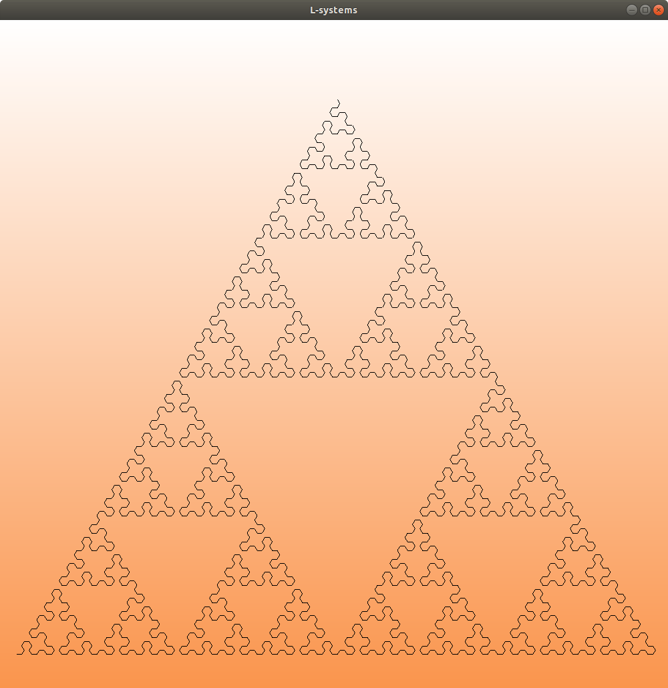

### About

Messing around with L-systems. A lot of the rendering code was taken from my [iterative Koch curve implementation](https://github.com/ajnirp/koch).

### Build

1. Ensure OpenGL and GLUT are installed.
2. Run `make`

### Run

Run `./lsystem`. Hit `<esc>` to close the window. Hit `B` and `F` to toggle between the two L-systems.

### Clean up

Run `make clean`

### Screenshots

